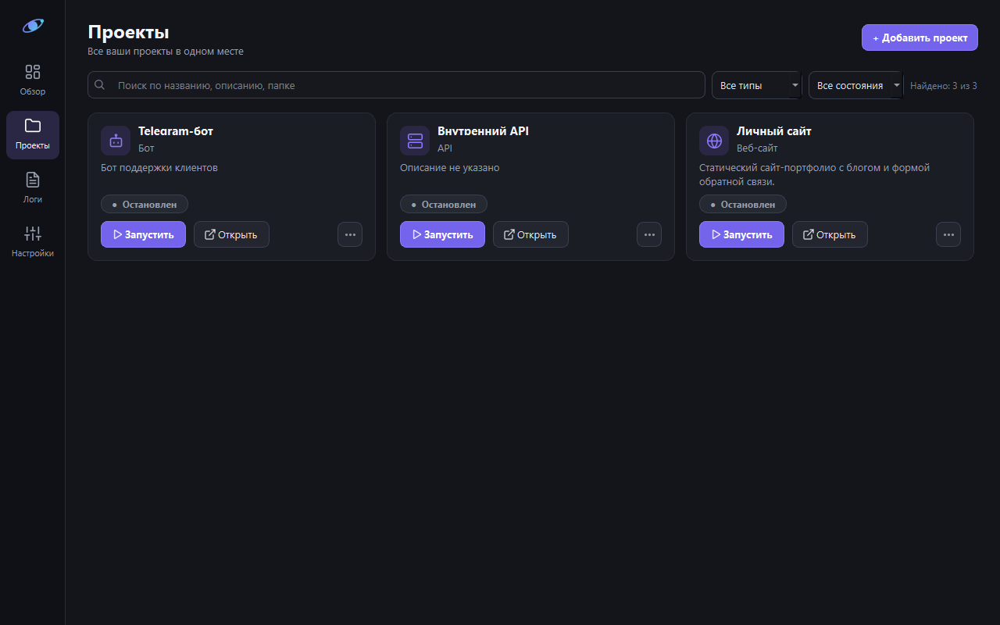

# Project Orbit

Компактный центр управления локальными проектами для Windows. Первая версия хранит проекты и команды в SQLite, запускает несколько команд на проект, показывает их состояние и вывод в реальном времени.



## Установка и запуск

Нужны Windows 10/11 и Python 3.10 или новее. В PowerShell из папки проекта:

```powershell
python -m venv .venv
.\.venv\Scripts\Activate.ps1
python -m pip install -r requirements.txt
python -m orbit
```

Также можно запустить `python main.py` или `run.bat` из папки проекта.

Если PowerShell запрещает запуск скрипта активации, используйте `.\.venv\Scripts\python.exe -m pip install -r requirements.txt` и `.\.venv\Scripts\python.exe -m orbit` без активации.

Данные сохраняются в `%LOCALAPPDATA%\ProjectOrbit\orbit.sqlite3`. При повторном запуске проекты и команды загружаются из этой базы. **Команды автоматически не запускаются** — только при нажатии «Запустить».

## Использование

1. На экране «Проекты» нажмите «Добавить проект», укажите название, тип и существующую локальную папку. Поиск охватывает название, описание и путь; фильтры отбирают проекты по типу и состоянию.
2. Добавьте команды, например `npm run dev` и `python app.py`. Каждая команда запускается из папки проекта. Строка выполняется через системную оболочку Windows, поэтому вводите только доверенные команды.
3. На карточке «Запустить» запускает все команды проекта. Кнопка «Открыть» ведёт к экрану проекта, где каждую команду можно запускать и останавливать отдельно. Экран «Логи» показывает вывод команд с временем каждой строки, поиском и копированием.
4. «Остановить» завершает дерево процесса, запущенного Project Orbit. При закрытии приложения активные процессы также останавливаются. Уже работавшие до открытия приложения процессы не затрагиваются.
5. Кнопки «Папка», «Редактор», «Репозиторий», «Сайт» и дополнительные ссылки открывают соответствующий ресурс. По умолчанию редактор — `code` (VS Code CLI); его можно изменить в форме проекта.

Редактирование проекта во время работы его команд блокируется, чтобы сохранённые команды и запущенные процессы не расходились. Перед удалением проекта приложение останавливает его команды. Репозиторий, сайт и дополнительные ссылки принимают только адреса HTTP(S).

Экран «Обзор» показывает число проектов, активных процессов и завершений с ошибкой. Старые SQLite базы автоматически получают поле типа проекта.

## Логи и локальная доступность

Логи сохраняются в `%LOCALAPPDATA%\ProjectOrbit\logs` и доступны после перезапуска Orbit. Хранится не больше 1 МБ на команду и 20 МБ суммарно; самые старые файлы удаляются при достижении общего лимита. Вывод процесса может содержать личные данные или токены — проверяйте его перед копированием и отправкой другим людям.

Orbit раз в 10 секунд проверяет адрес в поле «Сайт» и дополнительные ссылки, если они ведут на `localhost`, `127.0.0.1` или `[::1]`. Проверка выполняется асинхронно с тайм-аутом 2 секунды и показывает «доступен» или «недоступен» на карточке и экране проекта. Например, для WishList можно указать сайт `http://127.0.0.1:5173` и дополнительную ссылку «API» на `http://127.0.0.1:8010/docs`. Внешние адреса автоматически не опрашиваются. Это проверка ответа HTTP-страницы, а не состояния всех функций приложения.

## Импорт из GitHub

На экране «Проекты» нажмите **«Из GitHub»**. Orbit покажет публичные репозитории указанного пользователя без входа в аккаунт. Выберите репозиторий и папку, затем нажмите **«Импортировать»**. Только после этого Git скачает выбранный проект. Он появится в Orbit с ссылкой на репозиторий; распространённые команды запуска предлагаются по `package.json`, `main.py`, `app.py` или `bot.py`, но автоматически не выполняются. Команды нужно проверить и при необходимости изменить в форме проекта.

Для приватных репозиториев установите [GitHub CLI](https://cli.github.com/) и один раз войдите в аккаунт:

```powershell
winget install --id GitHub.cli -e
gh auth login --web
```

Затем в окне импорта выберите «Публичные и приватные (gh)». Orbit не хранит GitHub-токен; авторизацией управляет GitHub CLI. Уже существующую локальную папку проекта добавляйте обычной кнопкой «Добавить проект» — повторно скачивать её не нужно.

## Обновление локального проекта

Откройте проект в Orbit и нажмите **«Обновить код» → «Обновить»**. Кнопка доступна для папки с Git-репозиторием, когда команды проекта остановлены. Git получает недостающие изменения и обновляет существующую папку; новую копию проекта Orbit не создаёт. Если изменений на GitHub нет, появится сообщение «Уже установлена последняя версия».

Обновление выполняется в фоне и не запускает команды проекта. Для безопасности оно допускает только переход на более новый коммит текущей ветки без слияния; при локальных правках или расходящихся ветках процесс остановится и покажет причину. Несохранённые файлы не удаляются. Новые большие файлы в самом репозитории всё же займут место на диске.

## Обновление Orbit

После получения копии через `git clone` закройте приложение и выполните в PowerShell из папки Project-Orbit:

```powershell
.\update.bat
.\run.bat
```

`update.bat` запускает `update.ps1`: он проверяет привязку к GitHub и отсутствие локальных изменений, делает `git pull --ff-only` и устанавливает зависимости. Если ветка расходится с GitHub, скрипт остановится, не перезаписывая ваши файлы. Данные проектов в `%LOCALAPPDATA%\ProjectOrbit` не затрагиваются.

## Структура

- `orbit/models.py` — модели проекта и команды.
- `orbit/storage.py` — SQLite и сохранение проектов.
- `orbit/processes.py` — запуск, остановка и потоковая передача логов через очередь событий.
- `orbit/logs.py`, `orbit/log_pane.py` — ограниченное хранение логов, поиск и копирование.
- `orbit/health.py` — асинхронная проверка локальных HTTP-адресов.
- `orbit/windows_process_tree.py` — адресное завершение дочерних процессов через Windows API.
- `orbit/project_dialog.py` — форма проекта.
- `orbit/project_filters.py` — поиск и фильтры.
- `orbit/github.py`, `orbit/github_dialog.py` — список и импорт репозиториев без хранения токена.
- `orbit/git_update.py`, `orbit/git_update_dialog.py` — безопасное инкрементальное обновление локальных Git-проектов.
- `orbit/project_card.py`, `orbit/responsive_grid.py` — карточки и адаптивная сетка.
- `orbit/main_window.py` — навигация, экраны и управление действиями.
- `orbit/icons.py`, `orbit/theme.py` — SVG-иконки и тёмная тема.

Границы для следующих версий: мониторинг внешних сайтов и ИИ-анализ ошибок пока не реализованы.

## Проверка

```powershell
python -m unittest discover -s tests -v
python -m compileall -q orbit
```

Автоматические тесты проверяют SQLite, процессы, импорт и обновление GitHub, временные метки логов, их сохранение и ограничение размера, поиск и копирование, а также отбор локальных адресов для проверки. Локальный HTTP-тест запускается отдельно с `ORBIT_HEALTH_INTEGRATION=1`, поскольку обычная песочница может блокировать `127.0.0.1`. Вручную на Windows остаётся проверить живые логи WishList, индикаторы сайта и API при запуске и остановке обоих процессов, а также вид карточек при нескольких локальных ссылках.
